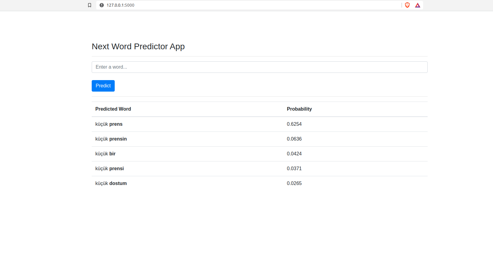

# word-predictor

Bir kelimenin ardından hangi kelimelerin gelebileceğini gösteren basit bir **n-gram** modeli.

### Demo

[Link](https://word-predictor.herokuapp.com/) üzerinden uygulamayı test edebilirsiniz.

### Kullanım

Repoyu indirdikten sonra gerekli kütüphaneleri **requirements.txt** ile kurabilirsiniz.

```shell
pip install -r requirements.txt
```

Flask'ın çalışması için komutları girin.

```shell
export FLASK_APP=app.py
flask run
```

Şimdi tarayıcınızda `localhost:5000` ziyaret edin. :tada:



### Gerekli Düzenlemeler

- [ ] app.py dosyasındaki fonksiyonların bölünmesi ve ayrı dosyalarda tutulması.
- [x] CI&CD Eklentisi
- [x] Kullanıcıdan girdi olarak kelime alınmalı ve en yüksek 3 ihtimalli kelime gösterilmeli.
- [x] Flask ile web üzerinde çalıştırma.
- [x] Kelime Düzeltimi (spell checking)​
- [ ] Veriseti büyütülmeli.
- [ ] Birden fazla kelime ile tahmin yapma. (unigram-trigram ..)
- [ ] Kelime kelime ayırım yaparken noktalama işaretleri siliniyor. Ancak nokta'dan sonra gelen kelime ile noktadan önce gelen kelime aslında komşu değildir. Düzeltilmesi gerekiyor. :warning:
- [ ] Demo olarak bir kelime girince en az 10 kelimelik bir cümle oluşturalım kelimeleri birbirine bağlayarak.
